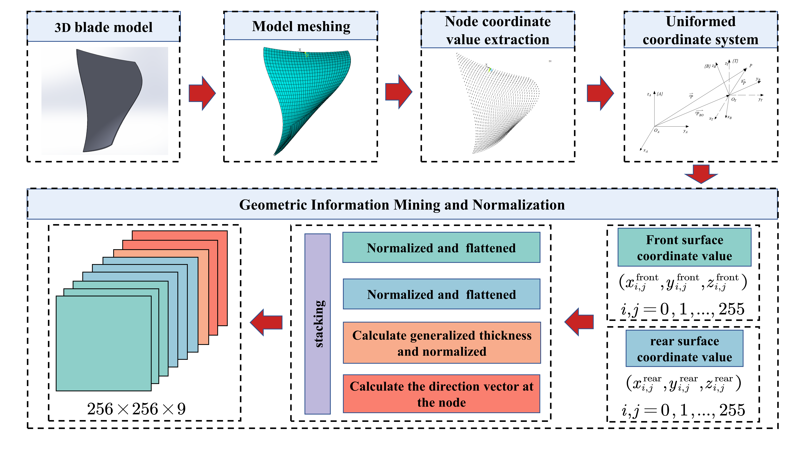

## Thin-walled blade dynamic-parameter prediction dataset

Total dataset download:
- Baidu Netdisk url：https://pan.baidu.com/s/1cA_88zU1n28m4sANREjbyQ 
- PassCode：9acl 
- If it cannot be opened, please contact czthdzw@hust.edu.cn directly.

### Input

The input of the network is the blade geometric information tensor converted from the 3D model.   

Considering the thin-walled structure of the blade, blade geometric information tensor is compressed into a form similar to the picture-like tensor which is formed by stacking several 2D matrices.  

As shown in the figure below, the nine 256 × 256 matrices correspond in turn to  the x, y, z coordinates of the front and back surfaces, the thickness and direction vectors.

Then, the nine normalized 256 × 256 matrices are stacked in turn to obtain the 256 × 256 × 9 tensor, called the geometric tensor. 

The specific data is in the `dataset/geo`, where the tensor data is stored in the format of `.npy`.

### Output

Output of the network is the modal information, i.e., the first five mode shapes and natural frequencies of the blade. 

The output mode shape can be converted into a tensor similar to the shape of the input geometric information tensor, and the output frequency can be converted into a vector. 

The mode shape tensor is a 256 × 256 × 5 tensor. 

As shown in the figure below, the five 256 × 256 matrices correspond to the first five mode shapes of the blade in turn.

The specific data is in the `dataset/shape`, where the tensor data is stored in the format of `.npy`.

The natural frequency vector is a 1 × 5 vector, representing the first five natural frequencies of the blade respectively, and the unit is Khz.

The specific data is in the `dataset/fre`, where the tensor data is stored in the format of `.npy`.

### Note

Each blade contains 16 machining stages.

Taking the natural frequency as an example, the data corresponding to the 16 machining stages of the first blade are `fre0.npy, fre1.npy,... ,fre15.npy`.

While, the data corresponding to the 16 machining stages of the second blade are `fre16.npy, fre17.npy,... ,fre31.npy`.

